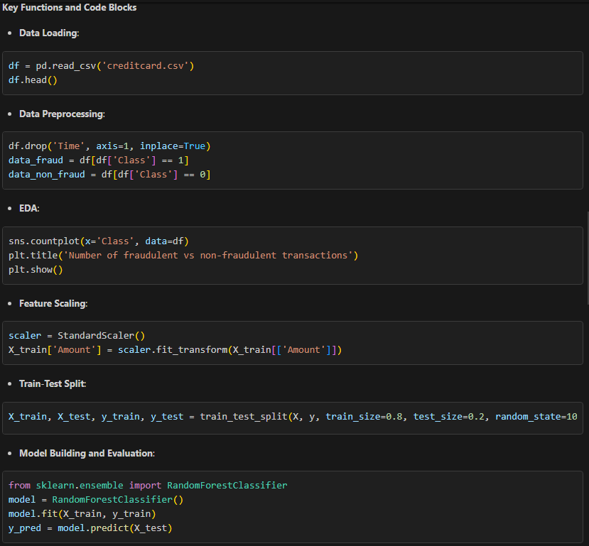

Credit Card Fraud Detection Project Documentation

## Problem Statement Overview
For many banks, retaining their high-profitable customers is the number one business goal. Banking fraud, however, poses a significant threat to this goal for different banks. In terms of incurring substantial financial losses, losing trust and credibility, banking fraud is an issue concerning both banks and customers alike. In this capstone, your task is to predict fraudulent credit card transactions with the help of machine learning models. You will analyse customer-level data and handle class imbalances present in the data set, along with performing model selection and hyperparameter tuning.

## Project Overview
The Credit Card Fraud Detection project aims to predict fraudulent credit card transactions using machine learning models. The data set is taken from the Kaggle website and has a total of 2,84,807 transactions; out of these, 492 are fraudulent. Since the data set is highly imbalanced, it needs to be handled before model building.The project addresses the challenge of highly imbalanced data, where fraudulent transactions are a small fraction of the total transactions.

## Project Structure
```
.vs/
    credit-card-fraud-detection/
        copilot-chat/
            9eea146b/
                sessions/
                    fd60dd2a-6118-46fa-9364-28ea19ab0415
        CopilotIndices/
            17.12.38.29086/
                SemanticSymbols.db-shm
                SemanticSymbols.db-wal
        FileContentIndex/
            7fe92940-dad2-4fdb-af9a-fbe2edcf6b72.vsidx
        v17/
            .wsuo
            DocumentLayout.backup.json
            DocumentLayout.json
    slnx.sqlite
    VSWorkspaceState.json
credit_card_fraud_detection.ipynb
README.md
```

## Key Components
1. **Notebook**: The main analysis and model-building are performed in the [`credit_card_fraud_detection.ipynb`](credit_card_fraud_detection.ipynb) notebook.
2. **README.md**: Provides an overview of the project, including the problem statement, business problem overview, understanding and defining fraud, data dictionary, and project pipeline.

## Project Pipeline
1. **Data Understanding**: Load and understand the dataset, including the features and their distributions.
2. **Exploratory Data Analysis (EDA)**: Perform univariate and bivariate analysis to explore the data and identify patterns.
3. **Data Preprocessing**: Handle missing values, drop unnecessary columns, and split the data into training and testing sets.
4. **Feature Scaling**: Scale the `Amount` feature to ensure it is on the same scale as other features.
5. **Model Building and Evaluation**: Build and evaluate machine learning models, tune hyperparameters, and select the best model based on evaluation metrics.

## Documentation for [`credit_card_fraud_detection.ipynb`](credit_card_fraud_detection.ipynb)

### Overview
The [`credit_card_fraud_detection.ipynb`](credit_card_fraud_detection.ipynb) notebook is designed to analyze and predict fraudulent credit card transactions using machine learning models. The dataset used in this project is sourced from Kaggle and contains transactions made by European cardholders in September 2013.

### Structure
The notebook is structured into several sections:
1. **Importing Libraries**: Import necessary libraries such as pandas, numpy, matplotlib, seaborn, and scikit-learn.
2. **Data Loading and Exploration**: Load the dataset and perform initial exploration to understand the structure and contents of the data.
3. **Data Preprocessing**: Handle missing values, drop unnecessary columns, and split the data into fraudulent and non-fraudulent transactions.
4. **Exploratory Data Analysis (EDA)**: Perform univariate and bivariate analysis to understand the distribution of features and the relationship between them.
5. **Feature Scaling**: Scale the `Amount` feature using `StandardScaler` from scikit-learn.
6. **Train-Test Split**: Split the data into training and testing sets.
7. **Model Building and Evaluation**: Build machine learning models, tune hyperparameters, and evaluate the models using appropriate metrics.

### Key Functions and Code Blocks


## Usage
To run the project, open the `credit_card_fraud_detection.ipynb` notebook in Jupyter or any compatible environment, and execute the cells sequentially. Ensure that the required libraries are installed and the dataset is available in the specified path.

## Dependencies
- pandas
- numpy
- matplotlib
- seaborn
- scikit-learn

Install the dependencies using:
```sh
pip install pandas numpy matplotlib seaborn scikit-learn
```

This documentation provides a comprehensive overview of the `credit_card_fraud_detection.ipynb` file and the overall solution, including the project structure, key components, and usage instructions.
